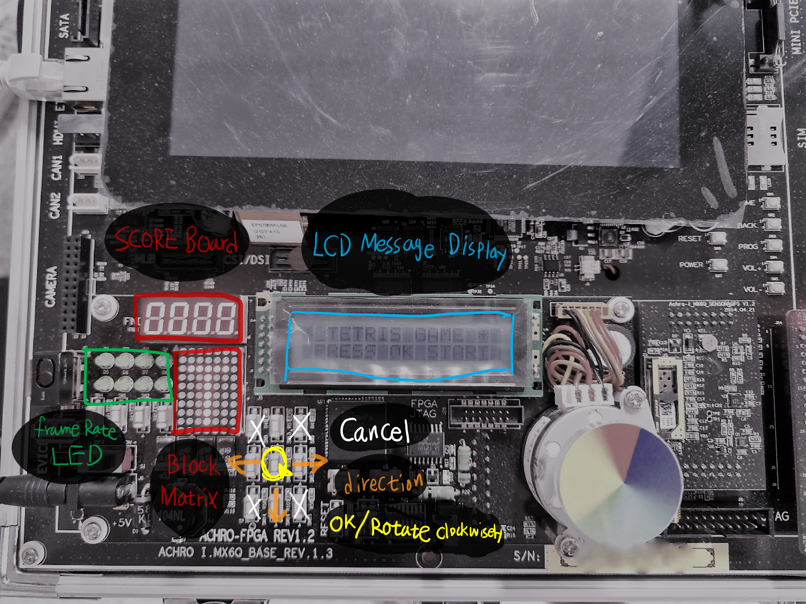
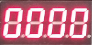
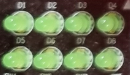
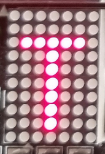
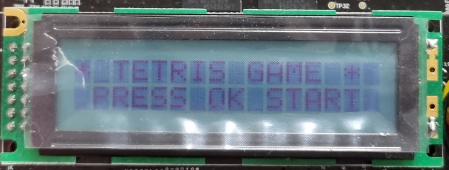
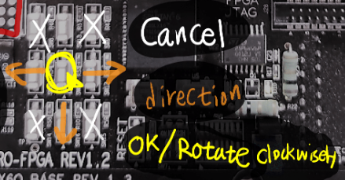
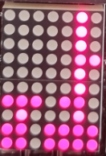
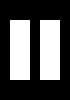

# mini_tetris

## 데모 동영상 (Demo Video)

https://youtu.be/--UvrgKFGB0

## 디바이스 소개 (Device Introduction)

### 인터페이스 (Interface)
* **Score Board**: 점수를 기록하는 4자리 Seven Segment

* **Frame Rate LED**: 테트리스 블록이 떨어지는 속도를 LED 로 보여줌

* **Block Matrix**: 블록을 담는 7 by 10 크기의 행렬

* **LCD Message Display**: 2 by 16 크기의 아스키 문자를 출력하는 LCD 디스플레이
  

  
### 조작키 (Game Control)

* **Cancel** 키: 꼭지점 부분에 위치한 취소 버튼 4개
* **Direction** 키: 블록을 좌우로 움직이거나, 아래로 즉시 내림
* **OK/Rotate Clockwisely** 키: 확인 버튼 또는 블록 시계방향 90 degree 회전시키는 키

## 씬 (Scene)

### 리소스 작업 (32-bit to 8-bit Converter)

* Piskel 프로그램을 사용하여 도트 씬 애니메이션을 제작
* C언어 Header 파일로 Export 가능
* 그러나 4바이트 ARGB 포맷으로 이루어짐
* Black/White 포맷의 1 Row - 8 Bit 포맷으로 변환하는 python3 코드 *gen_dot10x7_headers.py* 작성 
`./res/*.h -> ./dot10x7/*.h` 로 변환

### 인트로 씬 (SCENE_INTRO)

* 테트리스 게임의 타이틀과 제작자 명단 출력
* OK 버튼을 눌러서 게임을 시작

### 게임 씬 (SCENE_GAME)

* 방향키와 OK 버튼으로 블록을 조작
* 취소 버튼을 누르면 일시 정지 화면 전환

### 게임오버 씬 (SCENE_GAMEOVER)

* 게임오버 발생 시 문구 출력
* OK 버튼을 눌러 인트로 씬 전환

### 일시정지 씬 (SCENE_PAUSE)

* 플레이 도중 취소 버튼을 누르면 일시정지 모드 실행
* OK 버튼을 누르면 인트로 씬 전환
* 취소 버튼을 누르면 게임 이어서 진행

## 명령어

`make`

* 모든 디바이스 드라이버 ko 파일 빌드

`make clean`

* 모든 빌드파일 지움

`make app`

* app_game 실행파일 빌드

`./update_mod.sh`

* mknod, rmmod, insmod 관련 업데이트 명령어

`python3 gen_dot10x7_headers.py`

* 헤더 컨버팅 스크립트

`./app_game`

* 게임 실행

`Ctrl + C`

* 게임 종료